<h1 align="center"> Webinar - Cluster Santos Dumont </h1>
<h2 align="center"> Acesso e submissão de jobs </h2>
   
| 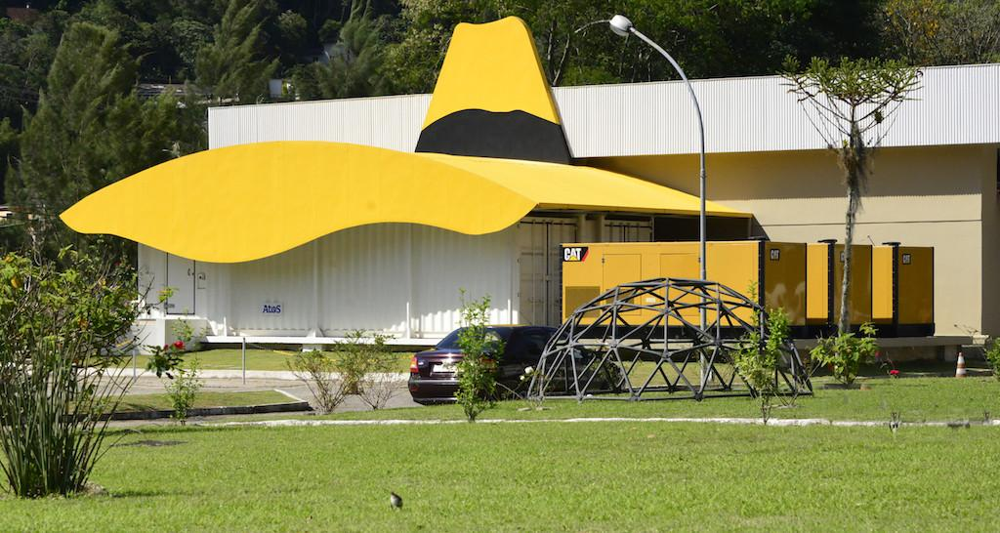 | 
|:--:| 
| Fonte da imagem: https://itforum365.com.br/lncc-e-coppe-abrem-chamada-para-uso-de-supercomputadores/ |

## Sumário

1. [Introdução ao cluster Santos Dumont](#introducao)

   - [Hardware](#hardware)
   - [Filas](#filas)

1. [Projeto CADASE](#cadase)

   - [Prazo para o uso](#prazo)
   - [Tempo de computação](#tempo)
   - [Cotas de disco](#cotas)
   - [Softwares do projeto](#software)
   - [Canais de Suporte](#suporte)

1. [Requisitos de acesso](#requisitos)

   - [Ativação da conta](#ativacao)
   - [Acesso VPN](#acesso_vpn)
   - [SSH Client](#client)

1. [Acessando o Santos Dumont](#acesso)

1. [Recomendação de ferramentas](#recomendacoes)

   - [Screen](#screen)
   - [Vim](#editor)
   - [SSHFS](#sshfs)

1. [Entendendo as partições dos discos](#particoes)

   - [/home](#home)
   - [/prj](#prj)
   - [/scratch](#scracth)

1. [Transferência de dados](#transferencia)

   - [Enviando arquivos](#envio)
   - [Recebendo arquivos](#recebimento)
   - [rclone](#rclone)

1. [Module](#module)

   - [module avail](#)
   - [module load](#)
   - [module unload](#)
   - [module purge](#)

1. [Compilando código C/C++](#compilacao1)

   - [Carregando os módulos necessários](#)
   - [Encontrando módulos necessários a partir de erros na compilação](#)

1. [Compilando código C/C++ com openMP e openMPI](#compilacao2)

   - [Carregando os módulos necessários](#)

1. [SLURM](#slurm)

   - [Comandos básicos](#)
     - [sinfo](#)
     - [squeue](#)
     - [scancel](#)
   - [Alocando recursos](#)
     - [srun](#)
     - [sbatch](#)
   - [Filas do SLURM](#)

1. [srun - Shell em modo interativo e jupyter notebook](#srun)

   - [Rodando um script em python](#)
   - [Acessado o jupyter notebook remotamente](#jupyter)

1. [sbatch - Submissão de jobs](#sbatch)
   - [Rodando um código C com openMP](#)
   - [Rodando um código C com MPI](#)

## Introdução 

**Breve Histórico**

O supercomputador Santos Dumont (SDumont), adquirido junto a empresa francesa ATOS/BULL, está localizado na sede do Laboratório Nacional de Computação Científica (LNCC), em Petrópolis-RJ, atuando como nó central (Tier-0) do Sistema Nacional de Processamento de Alto Desempenho - SINAPAD.

A primeira versão do SDumont (2015), chamada de "SDumont Base", possuía um total de 18.424 núcleos de CPU, distribuídos em 758 nós computacionais utilizando a tecnologia BullX B700.   No quarto trimestre de 2019 o SDumont recebeu uma expansão computacional, composta da tecnologia BullSequana X, que aumentou o poder computacional de 1,1 Petaflops para 5,1 Petaflops. Após essa expansão o SDumont passou a contar com um total de 34.688 núcleos de CPU, distribuídos em 1132 nós computacionais.

### Hardware 

<table class="tg">
<thead>
  <tr>
    <th class="tg-7btt">Qtd. de nós</th>
    <th class="tg-7btt">Processador</th>
    <th class="tg-7btt">Número de cores por nó</th>
    <th class="tg-7btt">Memória</th>
    <th class="tg-7btt">Acelerador</th>
  </tr>
</thead>
<tbody>
  <tr>
    <td class="tg-c3ow">504</td>
    <td class="tg-c3ow">2 x Intel Xeon E5-2695v2</td>
    <td class="tg-c3ow">24</td>
    <td class="tg-c3ow">64GB</td>
    <td class="tg-c3ow"></td>
  </tr>
  <tr>
    <td class="tg-c3ow">198</td>
    <td class="tg-c3ow">2 x Intel Xeon E5-2695v2</td>
    <td class="tg-c3ow">24</td>
    <td class="tg-c3ow">64GB</td>
    <td class="tg-c3ow">1 x NVIDIA K40</td>
  </tr>
  <tr>
    <td class="tg-c3ow">54</td>
    <td class="tg-c3ow">2 x Intel Xeon E5-2695v2</td>
    <td class="tg-c3ow">24</td>
    <td class="tg-c3ow">64GB</td>
    <td class="tg-7btt">1 x Xeon Phi 7120</td>
  </tr>
  <tr>
    <td class="tg-c3ow">1</td>
    <td class="tg-c3ow">16 x Intel Xeon Ivy Bridge</td>
    <td class="tg-c3ow">240</td>
    <td class="tg-c3ow">6TB</td>
    <td class="tg-c3ow"></td>
  </tr>
  <tr>
    <td class="tg-c3ow">246</td>
    <td class="tg-c3ow">2 x Intel Xeon Skylake 6152</td>
    <td class="tg-c3ow">48</td>
    <td class="tg-c3ow">384GB</td>
    <td class="tg-c3ow"></td>
  </tr>
  <tr>
    <td class="tg-c3ow">36</td>
    <td class="tg-c3ow">2 x Intel Xeon Skylake 6152</td>
    <td class="tg-c3ow">48</td>
    <td class="tg-c3ow">768GB</td>
    <td class="tg-c3ow"></td>
  </tr>
  <tr>
    <td class="tg-c3ow">94</td>
    <td class="tg-c3ow">2 x Intel Xeon Skylake 6152</td>
    <td class="tg-c3ow">48</td>
    <td class="tg-c3ow">384GB</td>
    <td class="tg-c3ow">4 x NVIDIA V100</td>
  </tr>
  <tr>
    <td class="tg-c3ow">1</td>
    <td class="tg-c3ow">2 x Intel Xeon Skylake 6148</td>
    <td class="tg-c3ow">40</td>
    <td class="tg-c3ow">384GB</td>
    <td class="tg-c3ow">8 x NVIDIA V100</td>
  </tr>
</tbody>
</table>

### Filas 

Os equipamentos do cluster Santos Dumont listados acima representam um valioso recurso computacional, que é compartilhado por diversos grupos de pequisas que possuem vínculo com o Laboratório Nacional de Computação Científica. Para manter os recursos disponíveis para todos os pesquisadores de forma consistente e justa, foi implementado um sistema de filas.

Em um computador não compartilhado, o usuário que define as prioridades de execução e pode rodar os programas diretamente em seu terminal ou gerenciador de janelas, no caso do SDumont, o usuário precisa criar um script e submetê-lo para uma fila (SLURM), que vai determinar em que momento o código entrará em execução, essa etapa extra será detalhada mais a frente.

---

---

## Projeto CADASE 

### Prazo para o uso 

Prazo de 6 meses a contar a partir de junho de 2020.

### Tempo de computação 

Unidades de Alocação (UAs) ~5.000.000

- 1,0 UA é igual a 1 (uma) hora de processamento em 1 (um) núcleo de
  processamento do nó com CPU

- Uma hora de processamento em 1 (um) núcleo dos nós com CPU+GPU
  corresponde à 1,5 UA

- Uma hora de processamento em 1 (um) núcleo de MESCA2 ou GDL-IA
  corresponde à 2,0 UAs

Com essa cota de processamento, nós poderíamos utilizar 45 nós CPU com ocupação de todos os cores, 24 horas por dia, e não chegaríamos ao limite antes do prazo de seis meses, portanto, utilizem o recurso sempre que possível.

### Cotas de disco 

O espaço em disco é limitado, temos acesso a duas partições com cotas:

- /prj 25TB (a confirmar)
- /scracth 25TB

### Softwares do projeto 

Os softwares do projeto estão localizados no diretório **_/scratch/cadase/app_**

Segue abaixo a lista de sotwares instalados até o momento:

      anaconda3
      devito
      firedrake
      htop
      openfoam
      scripts (exemplos do slurm e carregamento dos softwares do projeto)
      singularity (ainda não está funcional, helpdesk já foi acionado)

### Canais de Suporte 

Lista de e-mail do google groups

- cadase-members@googlegroups.com

Canal Slack

- http://cadasemembers.slack.com

Help Desk do LNCC

- helpdesk-sdumont@lncc.br

---

---

## Requisitos de acesso 

### Ativação da conta 

Entrar em contato com a equipe do Helpdesk do LNCC através do telefone (24) 2233-6050 e informar o número do seu atendimento, localizado no campo "assunto" da mensagem de e-mail confirmando a criação da sua conta.

### Acesso VPN 

Configurar um cliente VPN, abaixo segue um exemplo no ambiente Ubuntu:

<ol>
 <li>Abra o menu de configuração no canto superior direito.</li> 

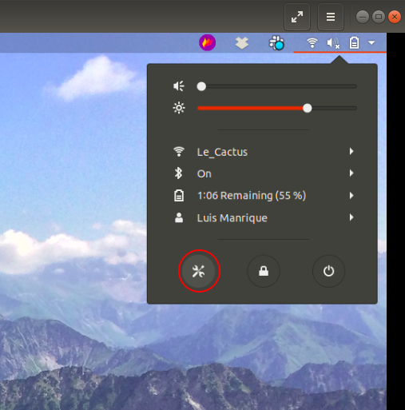

 <li>Clique no símbolo <b>+</b> para adicionar uma nova conexão.</li> 

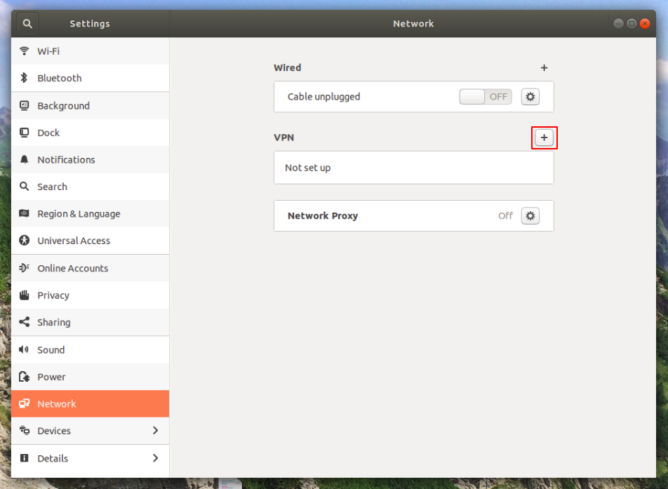

 <li>Selecione o <b>Cisco Compatible VPN</b>.</li> 

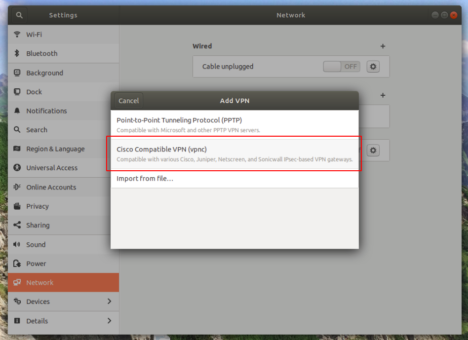

 <li>Adicione as credenciais enviadas pelo helpdesk do LNCC.
Para adicionar a senha do grupo, selecione <b>Store password ...</b>.</li> 

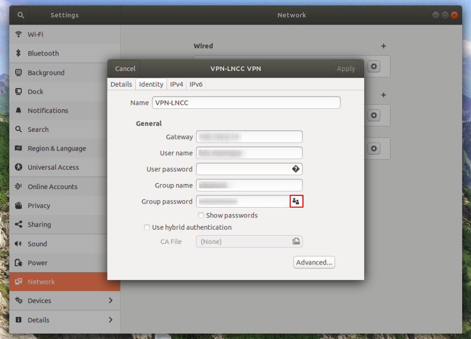

 <li>Selecione connect para estabelecer a conexão VPN.</li> 

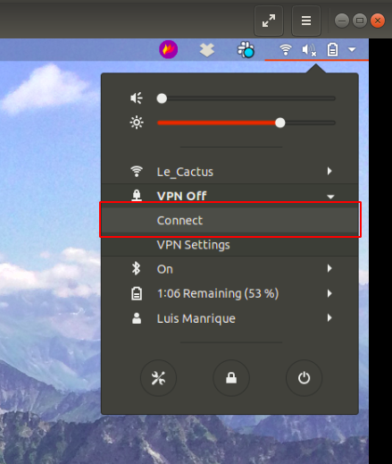

</ol>

### SSH Client 

O acesso ao cluster SDumont se dá através de conexão SSH. Os sistemas operacionais Linux e macOS já possuem um cliente instalado por padrão.
Abaixo segue o link para a instalação do cliente SSH PuTTY no Windows:

      https://www.chiark.greenend.org.uk/~sgtatham/putty/latest.html

---

---

## Acessando o Santos Dumont 

<ol>

 <li>Se conecte à rede VPN.</li> 

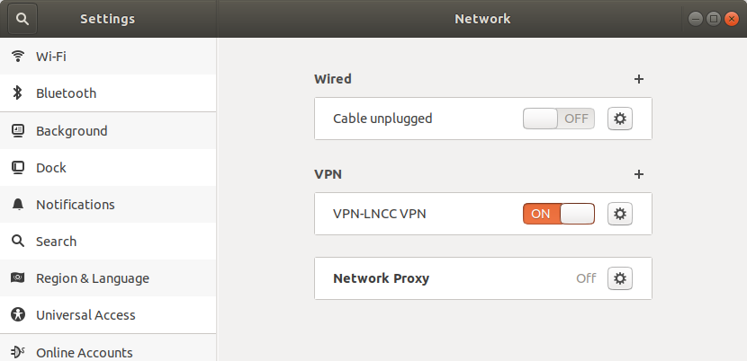

 <li>Estabeleça a conexão via ssh com: <b><i>ssh user@login.sdumont.lncc.br</i></b></li> 

</ol>

---

---

## Recomendação de ferramentas 

### Screen 

Quando estamos trabalhando em tarefas de longa duração em máquinas remotas, alguns problemas podem ocorrer: queda na conexão de internet; desconexão da sessão ssh; travamentos, entre outros. Quando algum desses problemas ocorre, o nosso trabalho é perdido.

Para evitar esse tipo de situação, podemos usar a ferramenta Screen ou GNU Screen, que é um multiplexador de terminais, ele serve para que possamos iniciar uma sessão do screen dentro do terminal convencional, e nele criamos terminais virtuais, que podem continuar rodando mesmo quando estamos deconectados. Podemos deixar algo rodando no terminal do cluster, desconectar e voltar algum tempo depois para retomar do mesmo ponto em que paramos.

    screen #Comandos básicos

    #Lista as sessões
    screen -ls

    #Cria uma nova sessão com o nome "minha-sessao"
    screen -S "minha-sessao"

    #Se vincula a uma sessão existente de nome "minha-sessao"
    screen -x minha-sessao

    Comandos dentro do screen

    Ctrl+A -> c      #Cria um novo terminal

    Ctrl+A -> "      #Lista todos os terminais da sessão

    Ctrl+A -> 0      #Alterna para o terminal 0

    Ctrl+A -> A      #Renomeia o terminal

    Ctrl+A -> S      #Divide a tela horizontalmente em duas regiões

    Ctrl+A -> |      #Divide a tela verticalmente em duas regiões

    Ctrl+A -> tab    #Alterna o foco nas regiões

    Ctrl+A -> X      #Fecha a região em foco

    Ctrl+A -> Q      #Fecha todas as regiões menos a que tem o foco

    Ctrl+A -> Ctrl+a #Alterna o terminal

    Ctrl+A -> d      #Desvincula o seu terminal da sessão

### Vim 

Trabalhando no ambiente de linha de comando do cluster, muitas vezes será necessário abrir arquivos para leitura e eventualmente para edições, dessa forma, se faz necessário ter o conhecimento de algum editor de textos no terminal. Abaixo eu apresento alguns comandos básicos do Vim, um dos editores mais populares do Linux.

      Vim #Comandos básicos

      vim arquivo.txt    #Abre o arquivo.txt, caso não ele não exista, um novo será criado

      Abrir e salvar arquivo

      Esc
      :w     #Salva o arquivo
      :q     #Sai do editor
      :wq!   #Salva e sai do editor

      Busca

      Esc
      /word     #Procura a palavra word de cima para baixo
      ?word     #Procura a palavra word de baixo para cima
      /jo[ha]n  #Procura por john ou joan
      /\< the   #Procura por the, theatre ou then

      Substituição

      Esc
      :%s/old/new/g      #Substitui todas as ocorrência de old por new
      :%s/old/new/gw     #Substitui todas as ocorrência de old por new com confirmação
      :2,35s/old/new/g   #Substitui todas as ocorrência de old por new entre as linhas entre 2 e 35
      :5,$s/old/new/g    #Substitui todas as ocorrência de old por new da linhas 5 até o final do arquivo
      :%s/^/hello/g      #Insere hello no início de cada linha

      Outros

      Esc
      :syntax on         #Ativa o modo de exibição de cores de sintaxe
      :set number        #Exibe o número da linha
      :set autoindent    #Ativo o modo de identação automática
      :set shiftwidth=4  #Configura o tamanho da identação

### SSHFS 

O SSHFS (Secure Shell FileSystem), é uma ferramenta que permite os usuários acessarem de forma segura um sistema de arquivos remoto, no exemplo a seguir iremos acessar os diretórios da sua conta no SDumont. Esse método é considerado seguro pois a comunicação se dá através do protocolo SSH.

Uma vez estabelecida a conexão, é possível utilizar ferramentas da sua interface gráfica para manipular os arquivos.

<ol>

 <li>Instalando o SSHFS no seu computador:</li> 

      sudo apt-get install sshfs

 <li>Criando o diretório que servirá para acessar os dados do SDumont:</li> 

      sudo mkdir ~/sdumont-fs

 <li>Estabelecendo a conexão:</li> 

      sudo sshfs luis.manrique@login.sdumont.lncc.br: ~/sdumont-fs

 <li>O diretório remoto deve aparecer no Natilus conforme a imagem abaixo:</li> 

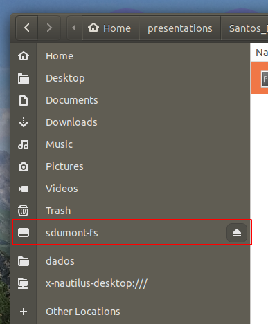

 <li>Desconectando do cluster:</li> 

      sudo umount ~/sdumont-fs

</ol>

---

---

## Entendendo as partições dos discos 

Nós temos duas partições principais: /prj e /scratch.

O /prj é o local em que os diretórios \$HOME de todos os usuários do projeto cadase são armazenados, ex: /prj/cadasa/user.
Esse diretório é compartilhado entre os nós de login (NFS), mas não deve ser utilizado para a submissão de jobs, os nós de processamento não o enxergam. Os dados não tem um prazo pré-determinado para serem excluídos, nele nós devemos armazenar dados permanentes.

O /scratch é o local em que os usuários do projeto devem copiar os dados que serão utlizados na submissão de jobs, sejam eles scripts, datasets e até mesmo as biliotecas e programas instalados. Cada usuário possui um diretório /scratch/cadase/user, e esse diretório é compartilhado entre os nós de processamento (Lustre), os arquivos nesse diretório são apagados após 60 dias sem serem modificados, por essa razão, copie sempre para o \$HOME os dados que devem ser preservados.

---

---

## Transferência de dados 

Utilizamos uma conexão VPN para conseguir acessar o nó de login do Santos Dumont, essa conexão deve ser mantida por todo o tempo em que estivermos conectados via SSH, transferindo dados por rsync ou scp.
Os dados enviados e recebidos através da VPN devem ser encriptados, por essa razão, a taxa de transferência é menor do que a nossa conexão pode alcançar.
Uma sugestão da equipe do LNCC é que nós possamos estabelecer uma conexão direta entre o cluster e algum IP público que sirva de repositório de dados, caso você possua um acesso desse tipo, prefira fazer upload dos dados diretamente do cluster para o IP público com o rsync e download utilizando o wget.

### Enviando arquivos 

Para enviar arquivos ou diretórios para o SDumont, utilize o exemplo abaixo:

      # rsync options source destination

      rsync -av my_local_file_or_dir user@login.sdumont.lncc.br:/prj/cadase/user/my_destination_dir/

### Recebendo arquivos 

Para receber arquivos ou diretórios do SDumont, utilize o exemplo abaixo:

      # rsync options source destination

      rsync -av user@login.sdumont.lncc.br:/prj/cadase/user/my_remote_file_or_dir /home/user/my_local_destination

Caso você tenha utilizado o rsync para enviar seus dados para um servidor com IP público, o download tanto na sua máquina local quanto no SDumont pode ser feito utilizando o wget. Exemplo:

       wget http://my_ip/files/my_remote_file

### rclone 

Uma outra opção que pode ser utilizada por aqueles que possuem uma conta @usp ou acesso ao google drive ilimitado, é o uso do rclone. Através desse programa é possível sincronizar o seu google drive e utilizá-lo para fazer cópias dos seus arquivos diretamente do terminal do SDumont.
Abaixo eu mostro um passo a passo de como instalar e configurar o Rclone + Google Drive.

<ol>

 <li>Faça login no SDumont e Instale o rclone copiando e colando os comandos abaixo no seu terminal:</li>

      cd
      wget https://downloads.rclone.org/rclone-current-linux-amd64.zip
      unzip rclone-current-linux-amd64.zip
      mv rclone-*-linux-amd64 rclone

      cp ~/.bashrc ~/.bashrc_bkp
      echo "alias rclone=~/rclone/rclone" >> ~/.bashrc
      source ~/.bashrc

 <li>Configurando o rclone:</li>

      rclone config

      No remotes found - make a new one
      n) New remote
      s) Set configuration password
      q) Quit config
      n/s/q> n

      name> gdrive

      Storage> drive

      Google Application Client Id
      Setting your own is recommended.
      See https://rclone.org/drive/#making-your-own-client-id for how to create your own.
      If you leave this blank, it will use an internal key which is low performance.
      Enter a string value. Press Enter for the default ("").
      client_id>
      Google Application Client Secret
      Setting your own is recommended.
      Enter a string value. Press Enter for the default ("").
      client_secret>

      scope> 1

      Enter a string value. Press Enter for the default ("").
      root_folder_id>

      Service Account Credentials JSON file path
      Leave blank normally.
      Needed only if you want use SA instead of interactive login.
      Enter a string value. Press Enter for the default ("").
      service_account_file>

      Edit advanced config? (y/n)
      y) Yes
      n) No (default)
      y/n> n

      Remote config
      Use auto config?
      * Say Y if not sure
      * Say N if you are working on a remote or headless machine
      y) Yes (default)
      n) No
      y/n> y

 <li>Não feche a janela atual, abra um novo terminal no seu computador e digite:</li>

      ssh -L 53682:localhost:53682 luis.manrique@login.sdumont.lncc.br

      #Verifique se o nó de login é o mesmo em que a url foi gerada, caso não seja, saia da sessão e tente fazer o "ssh -L" novamente

 <li>Volte para a janela anterior, copie a url e cole no seu browser.   Autorize a conta utilizando o seu e-mail @usp.br. Feche o browser e a janela com o túnel "ssh -L"</li>

 <li>Volte para a janela do rclone para terminar a configuração</li>

      Configure this as a team drive?
      y) Yes
      n) No (default)
      y/n> n

      y) Yes this is OK (default)
      e) Edit this remote
      d) Delete this remote
      y/e/d> y

      Current remotes:

      Name                 Type
      ====                 ====
      gdrive               drive

      e) Edit existing remote
      n) New remote
      d) Delete remote
      r) Rename remote
      c) Copy remote
      s) Set configuration password
      q) Quit config
      e/n/d/r/c/s/q> q

**Comandos básicos do rclone**

      [luis.manrique@sdumont11 ~]$ rclone listremotes
      gdrive:

      [luis.manrique@sdumont11 ~]$ rclone mkdir gdrive:sdumont

      [luis.manrique@sdumont11 ~]$ rclone lsd gdrive:
                -1 2020-03-31 10:56:53        -1 Colab Notebooks
                -1 2020-05-18 11:34:38        -1 Contas
                -1 2020-05-04 08:19:52        -1 Notas Reuniões RCGI
                -1 2020-05-26 09:14:28        -1 RCGI - Documentos
                -1 2020-06-21 00:09:40        -1 sdumont

      [luis.manrique@sdumont11 ~]$ rclone copy --progress /scratch/cadase/app/devito gdrive:sdumont/

      [luis.manrique@sdumont11 ~]$ rclone delete gdrive:sdumont/

</ol>

---

---

## Module 

---

---

## Compilando código C/C++ 

---

---

## Compilando código C/C++ com openMP e openMPI 

---

---

## SLURM 

---

---

## srun - Shell em modo interativo e jupyter notebook 

---

---

### Rodando um script em python

---

---

### Acessado o jupyter notebook remotamente 

<ol>

 <li>Utilize o comando <b><i>srun</i></b> para alocar o node que será utilizado em modo interativo.   O parâmetro <b><i>-p</i></b> serve para identifcar a fila utilizada, o <b><i>--pty bash -i</i></b> identifca o tipo de shell da sessão que será retornada.   Outros parâmetros não utilizados aqui podem servir para requisitar uma quantidade específica memória, uso exclusivo do node, número de tasks (processos mpi), etc. Confira outros parâmetros e os tipos de máquinas de cada fila no manual do usuário.  Aproveite para guardar o hostname do node que foi alocado.</li> 

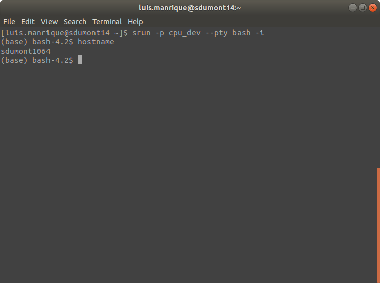

 <li>Carregue o anaconda com <b><i>eval "\$(/scratch/cadase/app/anaconda3/bin/conda shell.bash hook)"</i></b>. Neste exemplo iremos utilizar o Devito como exemplo, para tanto carregaremos o ambiente com: <b><i>conda activate devito</i></b></li> 

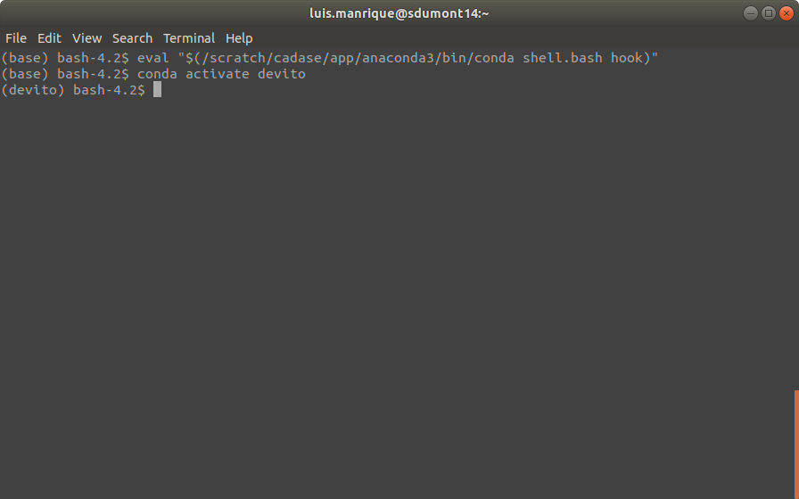

 <li>Inicialize o notebook com: <b><i>jupyter-lab --no-browser --ip=0.0.0.0</i></b></li> 

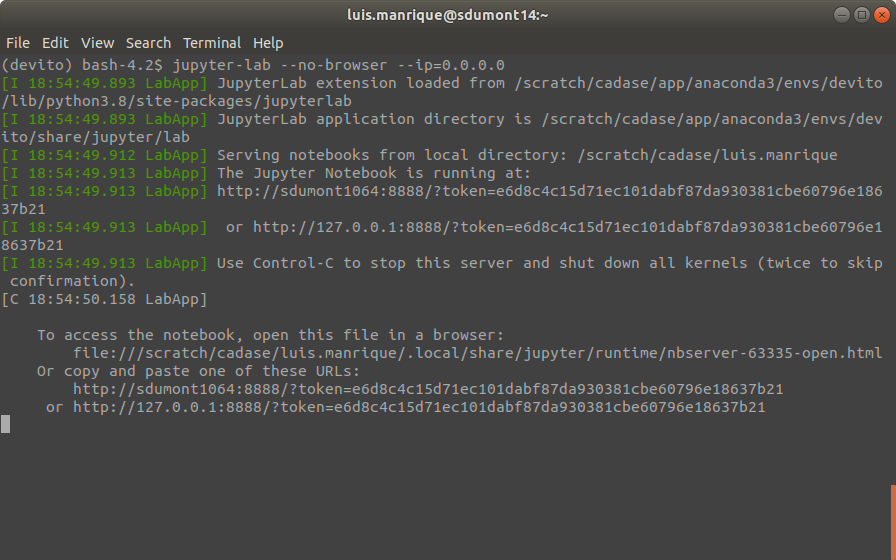

 <li>Abra um novo terminal e crie um túnel para acessar o notebook, utilize o hostname do node alocado anteriormente:<b><i> ssh -L 8888:hostname:8888 user@login.sdumont.lncc.br</i></b></li> 

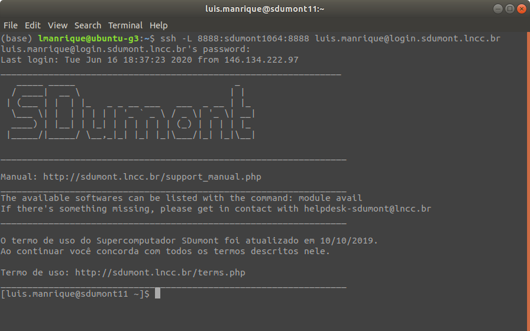

 <li>Utilize o terminal com a sessão do jupyter notebook aberta para copiar a url e cole no browser como no exemplo abaixo:</li> 

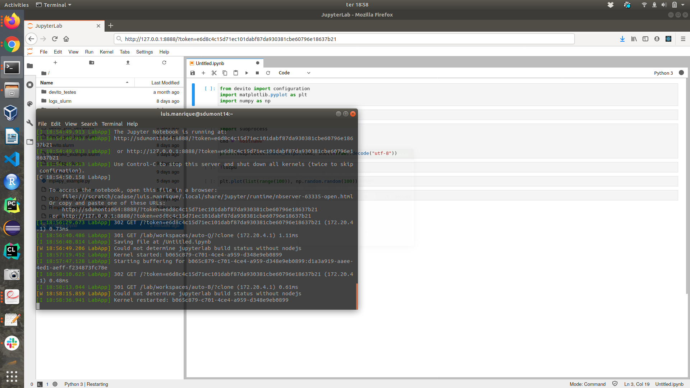

</ol>

---

---

## sbatch - Submissão de jobs 

---

---
