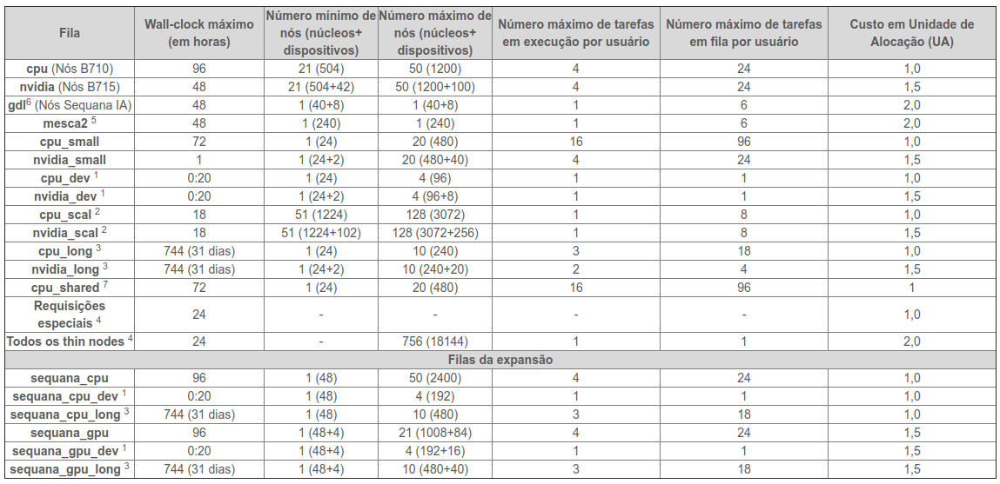

<h1 align="center"> Webinar - Cluster Santos Dumont </h1>
<h2 align="center"> Acesso e submissão de jobs </h2>
   
|  | 
|:--:| 
| Fonte da imagem: https://itforum365.com.br/lncc-e-coppe-abrem-chamada-para-uso-de-supercomputadores/ |

## Sumário

1. [Introdução ao cluster Santos Dumont](#introducao)

   - [Hardware](#hardware)
   - [Filas](#filas)

1. [Projeto CADASE](#cadase)

   - [Prazo para o uso](#prazo)
   - [Tempo de computação](#tempo)
   - [Cotas de disco](#cotas)
   - [Softwares do projeto](#software)
   - [Canais de Suporte](#suporte)

1. [Requisitos de acesso](#requisitos)

   - [Ativação da conta](#ativacao)
   - [Acesso VPN](#acesso_vpn)
   - [SSH Client](#client)

1. [Acessando o Santos Dumont](#acesso)

1. [Recomendação de ferramentas](#recomendacoes)

   - [Screen](#screen)
   - [Vim](#editor)
   - [SSHFS](#sshfs)

1. [Entendendo as partições dos discos](#particoes)

1. [Transferência de dados](#transferencia)

   - [Enviando arquivos](#envio)
   - [Recebendo arquivos](#recebimento)
   - [rclone](#rclone)

1. [Module](#module)

   - [Comandos básicos](#module-basico)

1. [Compilando código no headnode](#compilacao)

   - [Compilando código C/C++](#cpp)
   - [Compilando código C/C++ com openMP e openMPI](#cpp_mpi)

1. [SLURM](#slurm)

   - [Comandos básicos](#slurm_basico)
   - [srun - Rodando um script em python em modo interativo](#script_python)
   - [srun - Acessado o jupyter notebook remotamente](#jupyter)
   - [sbatch - Submissão de jobs](#sbatch)

1. [Exemplos SLURM](#exemplos)
   - [OpenFOAM](#openfoam-slurm)
   - [Lammps](#lammps-slurm)
   - [Devito](#devito-slurm)
   - [Firedrake](#firedrake-slurm)
   - [Código genérico MPI](#mpi-slurm)

## Introdução 

**Breve Histórico**

O supercomputador Santos Dumont (SDumont), adquirido junto a empresa francesa ATOS/BULL, está localizado na sede do Laboratório Nacional de Computação Científica (LNCC), em Petrópolis-RJ, atuando como nó central (Tier-0) do Sistema Nacional de Processamento de Alto Desempenho - SINAPAD.

A primeira versão do SDumont (2015), chamada de "SDumont Base", possuía um total de 18.424 núcleos de CPU, distribuídos em 758 nós computacionais utilizando a tecnologia BullX B700.   No quarto trimestre de 2019 o SDumont recebeu uma expansão computacional, composta da tecnologia BullSequana X, que aumentou o poder computacional de 1,1 Petaflops para 5,1 Petaflops. Após essa expansão o SDumont passou a contar com um total de 34.688 núcleos de CPU, distribuídos em 1132 nós computacionais.

### Hardware 

<table class="tg">
<thead>
  <tr>
    <th class="tg-7btt">Qtd. de nós</th>
    <th class="tg-7btt">Processador</th>
    <th class="tg-7btt">Número de cores por nó</th>
    <th class="tg-7btt">Memória</th>
    <th class="tg-7btt">Acelerador</th>
  </tr>
</thead>
<tbody>
  <tr>
    <td class="tg-c3ow">504</td>
    <td class="tg-c3ow">2 x Intel Xeon E5-2695v2</td>
    <td class="tg-c3ow">24</td>
    <td class="tg-c3ow">64GB</td>
    <td class="tg-c3ow"></td>
  </tr>
  <tr>
    <td class="tg-c3ow">198</td>
    <td class="tg-c3ow">2 x Intel Xeon E5-2695v2</td>
    <td class="tg-c3ow">24</td>
    <td class="tg-c3ow">64GB</td>
    <td class="tg-c3ow">1 x NVIDIA K40</td>
  </tr>
  <tr>
    <td class="tg-c3ow">54</td>
    <td class="tg-c3ow">2 x Intel Xeon E5-2695v2</td>
    <td class="tg-c3ow">24</td>
    <td class="tg-c3ow">64GB</td>
    <td class="tg-7btt">1 x Xeon Phi 7120</td>
  </tr>
  <tr>
    <td class="tg-c3ow">1</td>
    <td class="tg-c3ow">16 x Intel Xeon Ivy Bridge</td>
    <td class="tg-c3ow">240</td>
    <td class="tg-c3ow">6TB</td>
    <td class="tg-c3ow"></td>
  </tr>
  <tr>
    <td class="tg-c3ow">246</td>
    <td class="tg-c3ow">2 x Intel Xeon Skylake 6152</td>
    <td class="tg-c3ow">48</td>
    <td class="tg-c3ow">384GB</td>
    <td class="tg-c3ow"></td>
  </tr>
  <tr>
    <td class="tg-c3ow">36</td>
    <td class="tg-c3ow">2 x Intel Xeon Skylake 6152</td>
    <td class="tg-c3ow">48</td>
    <td class="tg-c3ow">768GB</td>
    <td class="tg-c3ow"></td>
  </tr>
  <tr>
    <td class="tg-c3ow">94</td>
    <td class="tg-c3ow">2 x Intel Xeon Skylake 6152</td>
    <td class="tg-c3ow">48</td>
    <td class="tg-c3ow">384GB</td>
    <td class="tg-c3ow">4 x NVIDIA V100</td>
  </tr>
  <tr>
    <td class="tg-c3ow">1</td>
    <td class="tg-c3ow">2 x Intel Xeon Skylake 6148</td>
    <td class="tg-c3ow">40</td>
    <td class="tg-c3ow">384GB</td>
    <td class="tg-c3ow">8 x NVIDIA V100</td>
  </tr>
</tbody>
</table>

### Filas 

Os equipamentos do cluster Santos Dumont listados acima representam um valioso recurso computacional, que é compartilhado por diversos grupos de pequisas que possuem vínculo com o Laboratório Nacional de Computação Científica. Para manter os recursos disponíveis para todos os pesquisadores de forma consistente e justa, foi implementado um sistema de filas.

Em um computador não compartilhado, o usuário que define as prioridades de execução e pode rodar os programas diretamente em seu terminal ou gerenciador de janelas, no caso do SDumont, o usuário precisa criar um script e submetê-lo para uma fila (SLURM), que vai determinar em que momento o código entrará em execução, essa etapa extra será detalhada mais a frente.

|                                |
| :----------------------------------------------------------------------: |
| Fonte da tabela: https://sdumont.lncc.br/support_manual.php?pg=support#5 |

---

---

## Projeto CADASE 

### Prazo para o uso 

Prazo de 6 meses a contar a partir de junho de 2020.

### Tempo de computação 

Unidades de Alocação (UAs) ~5.000.000

- 1,0 UA é igual a 1 (uma) hora de processamento em 1 (um) núcleo de
  processamento do nó com CPU

- Uma hora de processamento em 1 (um) núcleo dos nós com CPU+GPU
  corresponde à 1,5 UA

- Uma hora de processamento em 1 (um) núcleo de MESCA2 ou GDL-IA
  corresponde à 2,0 UAs

Com essa cota de processamento, nós poderíamos utilizar 45 nós CPU com ocupação de todos os cores, 24 horas por dia, e não chegaríamos ao limite antes do prazo de seis meses, portanto, utilizem o recurso sempre que possível.

### Cotas de disco 

O espaço em disco é limitado, temos acesso a duas partições com cotas:

- /prj 5TB
- /scracth 25TB

### Softwares do projeto 

Os softwares do projeto estão localizados no diretório **_/scratch/cadase/app_**

Segue abaixo a lista de sotwares instalados até o momento:

      anaconda3
      devito
      firedrake
      htop
      openfoam
      scripts (exemplos do slurm e carregamento dos softwares do projeto)
      singularity (ainda não está funcional, helpdesk já foi acionado)

### Canais de Suporte 

Lista de e-mail do google groups

- cadase-members@googlegroups.com

Canal Slack

- http://cadasemembers.slack.com

Help Desk do LNCC

- helpdesk-sdumont@lncc.br

---

---

## Requisitos de acesso 

### Ativação da conta 

Entrar em contato com a equipe do Helpdesk do LNCC através do telefone (24) 2233-6050 e informar o número do seu atendimento, localizado no campo "assunto" da mensagem de e-mail confirmando a criação da sua conta.

### Acesso VPN 

Configurar um cliente VPN, abaixo segue um exemplo no ambiente Ubuntu:

<ol>
 <li>Abra o menu de configuração no canto superior direito.</li> 

 <li>Clique no símbolo <b>+</b> para adicionar uma nova conexão.</li> 

 <li>Selecione o <b>Cisco Compatible VPN</b>.</li> 

 <li>Adicione as credenciais enviadas pelo helpdesk do LNCC.
Para adicionar a senha do grupo, selecione <b>Store password ...</b>.</li> 

 <li>Selecione connect para estabelecer a conexão VPN.</li> 

</ol>

### SSH Client 

O acesso ao cluster SDumont se dá através de conexão SSH. Os sistemas operacionais Windows, Linux e macOS já possuem um cliente ssh instalado por padrão.
Caso o cliente ssh ainda não esteja ativado no seu Windows, siga os passos listados abaixo:

<ol>
<li>Pressione WIN + I para abrir Settings</li>
<li>Abra Apps > Apps & features</li>
<li>Clique em Optional features</li>
<li>Clique +Add a feature</li>
<li>Procure OpenSSH Client na lista</li>
<li>Selecione e clique em Install</li>
<li>Reinicie o computador</li>
</ol>

---

---

## Acessando o Santos Dumont 

<ol>

 <li>Se conecte à rede VPN.</li> 

 <li>Estabeleça a conexão via ssh com: <b><i>ssh user@login.sdumont.lncc.br</i></b></li> 

</ol>

---

---

## Recomendação de ferramentas 

### Screen 

Quando estamos trabalhando em tarefas de longa duração em máquinas remotas, alguns problemas podem ocorrer: queda na conexão de internet; desconexão da sessão ssh; travamentos, entre outros. Quando algum desses problemas ocorre, o nosso trabalho é perdido.

Para evitar esse tipo de situação, podemos usar a ferramenta Screen ou GNU Screen, que é um multiplexador de terminais, ele serve para que possamos iniciar uma sessão do screen dentro do terminal convencional, e nele criamos terminais virtuais, que podem continuar rodando mesmo quando estamos deconectados. Podemos deixar algo rodando no terminal do cluster, desconectar e voltar algum tempo depois para retomar do mesmo ponto em que paramos.

    screen #Comandos básicos

    #Lista as sessões
    screen -ls

    #Cria uma nova sessão com o nome "minha-sessao"
    screen -S "minha-sessao"

    #Se vincula a uma sessão existente de nome "minha-sessao"
    screen -x minha-sessao

    Comandos dentro do screen

    Ctrl+A -> c      #Cria um novo terminal

    Ctrl+A -> "      #Lista todos os terminais da sessão

    Ctrl+A -> 0      #Alterna para o terminal 0

    Ctrl+A -> A      #Renomeia o terminal

    Ctrl+A -> S      #Divide a tela horizontalmente em duas regiões

    Ctrl+A -> |      #Divide a tela verticalmente em duas regiões

    Ctrl+A -> tab    #Alterna o foco nas regiões

    Ctrl+A -> X      #Fecha a região em foco

    Ctrl+A -> Q      #Fecha todas as regiões menos a que tem o foco

    Ctrl+A -> Ctrl+a #Alterna o terminal

    Ctrl+A -> d      #Desvincula o seu terminal da sessão

### Vim 

Trabalhando no ambiente de linha de comando do cluster, muitas vezes será necessário abrir arquivos para leitura e eventualmente para edições, dessa forma, se faz necessário ter o conhecimento de algum editor de textos no terminal. Abaixo eu apresento alguns comandos básicos do Vim, um dos editores mais populares do Linux.

      Vim #Comandos básicos

      vim arquivo.txt    #Abre o arquivo.txt, caso não ele não exista, um novo será criado

      Abrir e salvar arquivo

      Esc
      :w     #Salva o arquivo
      :q     #Sai do editor
      :wq!   #Salva e sai do editor

      Busca

      Esc
      /word     #Procura a palavra word de cima para baixo
      ?word     #Procura a palavra word de baixo para cima
      /jo[ha]n  #Procura por john ou joan
      /\< the   #Procura por the, theatre ou then

      Substituição

      Esc
      :%s/old/new/g      #Substitui todas as ocorrência de old por new
      :%s/old/new/gw     #Substitui todas as ocorrência de old por new com confirmação
      :2,35s/old/new/g   #Substitui todas as ocorrência de old por new entre as linhas entre 2 e 35
      :5,$s/old/new/g    #Substitui todas as ocorrência de old por new da linhas 5 até o final do arquivo
      :%s/^/hello/g      #Insere hello no início de cada linha

      Outros

      Esc
      :syntax on         #Ativa o modo de exibição de cores de sintaxe
      :set number        #Exibe o número da linha
      :set autoindent    #Ativo o modo de identação automática
      :set shiftwidth=4  #Configura o tamanho da identação

### SSHFS 

O SSHFS (Secure Shell FileSystem), é uma ferramenta que permite os usuários acessarem de forma segura um sistema de arquivos remoto, no exemplo a seguir iremos acessar os diretórios da sua conta no SDumont. Esse método é considerado seguro pois a comunicação se dá através do protocolo SSH.

Uma vez estabelecida a conexão, é possível utilizar ferramentas da sua interface gráfica para manipular os arquivos.

<ol>

 <li>Instalando o SSHFS no seu computador:</li> 

      sudo apt-get install sshfs

 <li>Criando o diretório que servirá para acessar os dados do SDumont:</li> 

      sudo mkdir ~/sdumont-fs

 <li>Estabelecendo a conexão:</li> 

      sudo sshfs luis.manrique@login.sdumont.lncc.br: ~/sdumont-fs

 <li>O diretório remoto deve aparecer no Natilus conforme a imagem abaixo:</li> 

 <li>Desconectando do cluster:</li> 

      sudo umount ~/sdumont-fs

</ol>

---

---

## Entendendo as partições dos discos 

Nós temos duas partições principais: /prj e /scratch.

O /prj é o local em que os diretórios \$HOME de todos os usuários do projeto cadase são armazenados, ex: /prj/cadasa/user.
Esse diretório é compartilhado entre os nós de login (NFS), mas não deve ser utilizado para a submissão de jobs, os nós de processamento não o enxergam. Os dados não tem um prazo pré-determinado para serem excluídos, nele nós devemos armazenar dados permanentes.

O /scratch é o local em que os usuários do projeto devem copiar os dados que serão utlizados na submissão de jobs, sejam eles scripts, datasets e até mesmo as biliotecas e programas instalados. Cada usuário possui um diretório /scratch/cadase/user, e esse diretório é compartilhado entre os nós de processamento (Lustre), os arquivos nesse diretório são apagados após 60 dias sem serem modificados, por essa razão, copie sempre para o \$HOME os dados que devem ser preservados.

---

---

## Transferência de dados 

Utilizamos uma conexão VPN para conseguir acessar o nó de login do Santos Dumont, essa conexão deve ser mantida por todo o tempo em que estivermos conectados via SSH, transferindo dados por rsync ou scp.
Os dados enviados e recebidos através da VPN devem ser criptografados, por essa razão, a taxa de transferência é menor do que a nossa conexão pode alcançar.
Uma sugestão da equipe do LNCC é que nós possamos estabelecer uma conexão direta entre o cluster e algum IP público que sirva de repositório de dados, caso você possua um acesso desse tipo, prefira fazer upload dos dados diretamente do cluster para o IP público com o rsync e download utilizando o wget.

### Enviando arquivos 

Para enviar arquivos ou diretórios para o SDumont, utilize o exemplo abaixo:

      # rsync options source destination

      rsync -av my_local_file_or_dir user@login.sdumont.lncc.br:/prj/cadase/user/my_destination_dir/

### Recebendo arquivos 

Para receber arquivos ou diretórios do SDumont, utilize o exemplo abaixo:

      # rsync options source destination

      rsync -av user@login.sdumont.lncc.br:/prj/cadase/user/my_remote_file_or_dir /home/user/my_local_destination

Caso você tenha utilizado o rsync para enviar seus dados para um servidor com IP público, o download tanto na sua máquina local quanto no SDumont pode ser feito utilizando o wget. Exemplo:

       wget http://my_ip/files/my_remote_file

### rclone 

Uma outra opção que pode ser utilizada por aqueles que possuem uma conta @usp ou acesso ao google drive ilimitado, é o uso do rclone. Através desse programa é possível sincronizar o seu google drive e utilizá-lo para fazer cópias dos seus arquivos diretamente do terminal do SDumont.

Abaixo eu mostro um passo a passo de como instalar e configurar o Rclone + Google Drive.

**Instalação**

<ol>

 <li>Faça login no SDumont e Instale o rclone copiando e colando os comandos abaixo no seu terminal:</li>

      cd
      wget https://downloads.rclone.org/rclone-current-linux-amd64.zip
      unzip rclone-current-linux-amd64.zip
      mv rclone-*-linux-amd64 rclone

      cp ~/.bashrc ~/.bashrc_bkp
      echo "alias rclone=~/rclone/rclone" >> ~/.bashrc
      source ~/.bashrc

 <li>Configurando o rclone:</li>

      rclone config

      No remotes found - make a new one
      n) New remote
      s) Set configuration password
      q) Quit config
      n/s/q> n

      name> gdrive

      Storage> drive

      Google Application Client Id
      Setting your own is recommended.
      See https://rclone.org/drive/#making-your-own-client-id for how to create your own.
      If you leave this blank, it will use an internal key which is low performance.
      Enter a string value. Press Enter for the default ("").
      client_id>
      Google Application Client Secret
      Setting your own is recommended.
      Enter a string value. Press Enter for the default ("").
      client_secret>

      scope> 1

      Enter a string value. Press Enter for the default ("").
      root_folder_id>

      Service Account Credentials JSON file path
      Leave blank normally.
      Needed only if you want use SA instead of interactive login.
      Enter a string value. Press Enter for the default ("").
      service_account_file>

      Edit advanced config? (y/n)
      y) Yes
      n) No (default)
      y/n> n

      Remote config
      Use auto config?
      * Say Y if not sure
      * Say N if you are working on a remote or headless machine
      y) Yes (default)
      n) No
      y/n> y

 <li>Não feche a janela atual, abra um novo terminal no seu computador e digite:</li>

      ssh -L 53682:localhost:53682 luis.manrique@login.sdumont.lncc.br

      #Verifique se o nó de login é o mesmo em que a url foi gerada, caso não seja, saia da sessão
      e tente fazer o "ssh -L" novamente

 <li>Volte para a janela anterior, copie a url e cole no seu browser.   Autorize a conta utilizando o seu e-mail @usp.br. Feche o browser e a janela com o túnel "ssh -L"</li>

 <li>Volte para a janela do rclone para terminar a configuração</li>

      Configure this as a team drive?
      y) Yes
      n) No (default)
      y/n> n

      y) Yes this is OK (default)
      e) Edit this remote
      d) Delete this remote
      y/e/d> y

      Current remotes:

      Name                 Type
      ====                 ====
      gdrive               drive

      e) Edit existing remote
      n) New remote
      d) Delete remote
      r) Rename remote
      c) Copy remote
      s) Set configuration password
      q) Quit config
      e/n/d/r/c/s/q> q

**Comandos básicos do rclone**

      [luis.manrique@sdumont11 ~]$ rclone listremotes
      gdrive:

      [luis.manrique@sdumont11 ~]$ rclone mkdir gdrive:sdumont

      [luis.manrique@sdumont11 ~]$ rclone lsd gdrive:
                -1 2020-03-31 10:56:53        -1 Colab Notebooks
                -1 2020-05-18 11:34:38        -1 Contas
                -1 2020-05-04 08:19:52        -1 Notas Reuniões RCGI
                -1 2020-05-26 09:14:28        -1 RCGI - Documentos
                -1 2020-06-21 00:09:40        -1 sdumont

      [luis.manrique@sdumont11 ~]$ rclone copy --progress /scratch/cadase/app/devito gdrive:sdumont/

      [luis.manrique@sdumont11 ~]$ rclone delete gdrive:sdumont/

</ol>

---

---

## Module 

Um cluster HPC é compartilhado por muitos usuários, cada um deles com requerimentos de softwares diferentes, por essa razão, a quantidade de aplicativos, bibliotecas e compilares é muito grande, e cada um desses pode ter diversas versões instaladas. Para facilitar a manutenção e evitar incidentes de segurança, essas aplicações são instaladas em locais não padrão.

Não é possível, ou ao menos são desejável, utilizar todos os softwares e bibliotecas ao mesmo tempo, versões diferentes da mesma aplicação costumam dar conflito.

Uma aplicação que vai para a produção, deve ter o seu ambiente de bibliotecas e executáveis configurados fora a aplicação em si. Isso é feito usando um conjunto de instruções e variáveis de ambiente para a aplicação em específico. Para simplificar esse procedimento, no SDumont nós fazemos isso através da aplicação **module**

### Comandos básicos 

      Antes de começar com a compilação, é recomendado limpar todos os módulos carregados. Dessa forma você
      terá maior controle dos módulos que estão em uso e ficará mais fácil de criar o script de submissão do
      job, como veremos na seção do SLURM.

      module purge     # Descarrega todos os módulos

      module list      # Lista os módulos carregados

      module avail     # Lista os módulos disponíveis

        # É possível usar o avail com o nome parcial do módulo conforme exemplo:
        [luis.manrique@sdumont14 ~]$ module avail open
        -------------------------------- /scratch/app/modulos ----------------------------------
        opencoarrays/2.7.0            openmpi/gnu/2.0.4.2+cuda      openmpi/gnu/ilp64/2.0.4.2
        openmolcas/intel              openmpi/gnu/3.1.4             openmpi/gnu/mt/2.0.4.2
        openmolcas/openmpi-gcc        openmpi/gnu/3.1.5_gcc-7.4     openmpi/gnu/mt/ilp64/2.0.4.2
        openmpi/gnu/1.8.6             openmpi/gnu/4.0.1             openmpi/icc/2.0.4.2
        openmpi/gnu/2.0.4.14          openmpi/gnu/4.0.1+cuda        openmpi/icc/debug/2.0.2.10
        openmpi/gnu/2.0.4.2           openmpi/gnu/4.0.1_gcc-7.4     openmpi/icc/ilp64/2.0.4.2
        -----------------------------------------------------------------------------------------

      module load     # Carregado um módulo

        Exemplo: module load openmpi/gnu/3.1.5_gcc-7.4

      module unload   # Descarregado um módulo

        Exemplo: module unload openmpi/gnu/3.1.5_gcc-7.4

      module show     # Mostra detalhes de um pacote que é passado por argumento

        [luis.manrique@sdumont14 ~]$ module show openmpi/gnu/3.1.5_gcc-7.4
        -------------------------------------------------------------------
        /scratch/app/modulos/openmpi/gnu/3.1.5_gcc-7.4:

        module-whatis    Sets up Open MPI/SHMEM v3.1.5 (compiled with GCC 7.4) in your enviornment
        prepend-path     PATH /scratch/app/openmpi/3.1_gnu-7.4/bin
        prepend-path     MANPATH /scratch/app/openmpi/3.1_gnu-7.4/share/man
        prepend-path     LD_LIBRARY_PATH /scratch/app/openmpi/3.1_gnu-7.4/lib
        prepend-path     PKG_CONFIG_PATH /scratch/app/openmpi/3.1_gnu-7.4/lib/pkgconfig
        setenv           MPI_ROOT /scratch/app/openmpi/3.1_gnu-7.4
        setenv           OMPI_PATH /scratch/app/openmpi/3.1_gnu-7.4/bin
        setenv           MPI_HOME /scratch/app/openmpi/3.1_gnu-7.4
        setenv           MPI_INCLUDE /scratch/app/openmpi/3.1_gnu-7.4/include
        setenv           MPI_LIB /scratch/app/openmpi/3.1_gnu-7.4/lib
        setenv           OMPI_LD_LIBRARY_PATH /scratch/app/openmpi/3.1_gnu-7.4/lib
        setenv           OMPI_MCA_btl_openib_allow_ib 1
        prepend-path     -d   LDFLAGS -L/scratch/app/openmpi/3.1_gnu-7.4/lib
        prepend-path     -d   CPPFLAGS -I/scratch/app/openmpi/3.1_gnu-7.4/include
        module           unload gcc/7.4
        -------------------------------------------------------------------

        Essas informações são úteis para resolver erros na hora da compilação.

---

---

## Compilando código no headnode 

Abaixo iremos compilar códigos C, mas o mesmo procedimento poderá ser utilizado para compilar um código C++ ou Fortran, desde que eles sejam compatíveis com os compiladores disponíveis no cluster.
O procedimento para compilar outras linguages é similar, logar no headnode, carregar os módulos e compilar.

### Compilando código C/C++ 

Neste exemplo vamos compilar um código escrito em C.

        Descarregando os módulos

        [luis.manrique@sdumont14 webinar]$ module purge

        Verificando a versão do GCC padrão do sistema

        [luis.manrique@sdumont14 webinar]$ gcc --version
        gcc (GCC) 4.8.5 20150623 (Red Hat 4.8.5-36)
        Copyright (C) 2015 Free Software Foundation, Inc.
        This is free software; see the source for copying conditions.  There is NO
        warranty; not even for MERCHANTABILITY or FITNESS FOR A PARTICULAR PURPOSE.

        A versão padrão do GCC não serve para o código do exemplo, por essa razão, vamos procurar todas as
        versões disponíveis do compilador.

        [luis.manrique@sdumont14 webinar]$ module avail gcc

        --------------------- /scratch/app/modulos -------------------------
        gcc/6.5 gcc/7.4 gcc/8.3

        Carregando a versão 8.3

        [luis.manrique@sdumont14 webinar]$ module load gcc/8.3

        Verificando a versão carregada

        [luis.manrique@sdumont14 webinar]$ gcc --version
        gcc (GCC) 8.3.0
        Copyright (C) 2018 Free Software Foundation, Inc.
        This is free software; see the source for copying conditions.  There is NO
        warranty; not even for MERCHANTABILITY or FITNESS FOR A PARTICULAR PURPOSE.

        Compilando o código

        [luis.manrique@sdumont14 webinar]$ gcc mandelbrot_seq.c -o mandelbrot_seq

### Compilando código C/C++ com openMP e openMPI 

Neste exemplo vamos compilar um código escrito em C com openMP e MPI.

        Descarregando os módulos

        [luis.manrique@sdumont11 webinar]$ module purge

        Para compilar esse código é necessário carregar as bibliotecas MPI, vamos usar o mpicc.

        [luis.manrique@sdumont11 C_par]$ module avail openmpi
        -------------------------------------- /scratch/app/modulos ------------------------------------------
        openmpi/gnu/1.8.6             openmpi/gnu/2.0.4.2+cuda      openmpi/gnu/4.0.1
        openmpi/gnu/2.0.4.14          openmpi/gnu/3.1.4             openmpi/gnu/4.0.1+cuda
        openmpi/gnu/2.0.4.2           openmpi/gnu/3.1.5_gcc-7.4     openmpi/gnu/4.0.1_gcc-7.4

        Carregando a versão 3.1.4

        [luis.manrique@sdumont11 webinar]$ module load openmpi/gnu/3.1.4

        Compilando o código

        [luis.manrique@sdumont11 webinar]$ mpicc -std=c11 mandelbrot_mpi_omp.c -o mandelbrot_mpi_omp -fopenmp

---

---

## SLURM 

### Comandos básicos 

        sinfo #Exibe informação sobre as filas do SLURM

        #Como o SDumont tem muitas partições, use o -s para resumir a lista
        sinfo -s
        [luis.manrique@sdumont11 ~]$ sinfo -s
        PARTITION        AVAIL  TIMELIMIT   NODES(A/I/O/T)  NODELIST
        cpu*                up   infinite    361/19/28/408  sdumont[1080-1149,1159-1193,1201-1503]
        nvidia              up   infinite     171/20/1/192  sdumont[3006-3197]
        gdl                 up   infinite          1/0/0/1  sdumont4000
        mesca2              up   infinite          1/0/0/1  sdumont57
        cpu_small           up   infinite    361/19/28/408  sdumont[1080-1149,1159-1193,1201-1503]
        nvidia_small        up   infinite     171/20/1/192  sdumont[3006-3197]
        cpu_dev             up   infinite    363/47/28/438  sdumont[1064-1149,1159-1193,1201-1503,5030-5043]
        nvidia_dev          up   infinite     171/20/1/192  sdumont[3006-3197]
        cpu_scal            up   infinite    361/19/28/408  sdumont[1080-1149,1159-1193,1201-1503]
        cpu_long            up   infinite    361/19/28/408  sdumont[1080-1149,1159-1193,1201-1503]
        nvidia_scal         up   infinite     171/20/1/192  sdumont[3006-3197]
        nvidia_long         up   infinite     171/20/1/192  sdumont[3006-3197]
        cpu_shared          up   infinite        18/0/2/20  sdumont[5010-5029]
        sequana_cpu         up   infinite     127/26/3/156  sdumont[6104-6169,6192-6251,6255-6275,6279-6287]
        sequana_cpu_dev     up      20:00     127/45/3/175  sdumont[6085-6169,6192-6251,6255-6275,6279-6287]
        sequana_cpu_long    up   infinite     127/26/3/156  sdumont[6104-6169,6192-6251,6255-6275,6279-6287]
        sequana_gpu         up   infinite       31/21/0/52  sdumont[8034-8055,8064-8083,8085-8091,8093-8095]
        sequana_gpu_dev     up      20:00       31/26/0/57  sdumont[8029-8055,8064-8083,8085-8091,8093-8095]
        sequana_gpu_long    up   infinite       31/21/0/52  sdumont[8034-8055,8064-8083,8085-8091,8093-8095]
        cptec               up   infinite       74/16/0/90  sdumont[6104-6169,6192-6215]
        cptec_long          up   infinite       74/16/0/90  sdumont[6104-6169,6192-6215]
        dockthor_sequana    up   infinite          0/1/0/1  sdumont8033
        sd_cpu              up   infinite     116/56/3/175  sdumont[6000-6084,6192-6251,6255-6275,6279-6287]
        sd_cpu_bigmem       up   infinite        4/32/0/36  sdumont[6000-6035]
        sd_gpu              up   infinite        48/9/1/58  sdumont[8000-8027,8064-8083,8085-8091,8093-8095]
        ict_cpu             up   infinite      77/26/9/112  sdumont[6170-6251,6255-6275,6279-6287]
        ict_gpu             up   infinite       27/11/0/38  sdumont[8056-8083,8085-8091,8093-8095]

        squeue #Exibe os jobs nas diferentes partições

        #O comando exibe todos os jobs na fila, use o -u user para listar apenas as suas submissões
        squeue -u luis.manrique

        #Para ter uma estimativa de quanto o job iniciará utilize o --start
        squeue --start -u luis.manrique

        scancel #Comando utilizado para cancelar jobs

        #Verifique o job_id com o squeue e depois use como argumento para o scancel
        scancel job_id

        srun #Aloca os recursos e roda a aplicação de imediato, é possível rodar no modo interativo
              e usar o shell

        sbatch #Submete o trabalho para uma fila, aloca os recursos e roda de forma não interativa

### srun - Rodando um script em python me modo interativo 

<ol>
 <li>Reserve um ou mais nodes para execução com o srun</li>

        srun --nodes=1 -p cpu_dev --pty bash -i
        # --nodes=N        quantidade de nodes
        # -p               partição/fila que será utilizada, verifique a disponibilidade e nomes
                           com o sinfo
        # --pty bash -i    retorna uma sessão bash

 <li>Carregue o python</li>

        #Para utilizar o anaconda da partição do cadase:
          eval "$(/scratch/cadase/app/anaconda3/bin/conda shell.bash hook)"
        #Verificando a versão do python em uso
          (base) bash-4.2$ which -a python
          /scratch/cadase/app/anaconda3/bin/python
          /usr/bin/python

        #Para utilizar o python e bibliotecas do firedrake da partição do cadase
          . /scratch/cadase/app/firedrake/bin/activate
        #Verificando a versão do python em uso
          (firedrake) (base) bash-4.2$ which -a python
          /scratch/cadase/app/firedrake/bin/python
          /scratch/app/anaconda3/2018.12/bin/python
          /usr/bin/python

 <li>Exemplo de uso com o código benchmark do devito</li>

        srun --nodes=1 --cpus-per-task=24 --exclusive -p cpu_dev --pty bash -i
        module purge
        module load gcc/8.3

        #Carregando o Anaconda + Devito
        eval "$(/scratch/cadase/app/anaconda3/bin/conda shell.bash hook)"
        source activate /scratch/cadase/app/anaconda3/envs/devito

        #Configurando o ambiente para o Devito
        export DEVITO_ARCH=gcc
        export DEVITO_PLATFORM=intel64
        export DEVITO_LOGGING=DEBUG
        export DEVITO_LANGUAGE=openmp
        export DEVITO_AUTOTUNING=aggressive
        export OMP_NUM_THREADS=24

        python /scratch/cadase/app/devito/benchmarks/user/benchmark.py bench -P acoustic -d 512 512 512 -so 12 --arch gcc --tn 100 -a aggressive

</ol>

### srun - Acessado o jupyter notebook remotamente 

<ol>

 <li>Utilize o comando <b><i>srun</i></b> para alocar o node que será utilizado em modo interativo.   O parâmetro <b><i>-p</i></b> serve para identifcar a fila utilizada, o <b><i>--pty bash -i</i></b> identifca o tipo de shell da sessão que será retornada.   Outros parâmetros não utilizados aqui podem servir para requisitar uma quantidade específica memória, uso exclusivo do node, número de tasks (processos mpi), etc. Confira outros parâmetros e os tipos de máquinas de cada fila no manual do usuário.  Aproveite para guardar o hostname do node que foi alocado.</li> 

 <li>Carregue o anaconda com <b><i>eval "\$(/scratch/cadase/app/anaconda3/bin/conda shell.bash hook)"</i></b>. Neste exemplo iremos utilizar o Devito como exemplo, para tanto carregaremos o ambiente com: <b><i>conda activate devito</i></b></li> 

 <li>Inicialize o notebook com: <b><i>jupyter-lab --no-browser --ip=0.0.0.0</i></b></li> 

 <li>Abra um novo terminal e crie um túnel para acessar o notebook, utilize o hostname do node alocado anteriormente:<b><i> ssh -L 8888:hostname:8888 user@login.sdumont.lncc.br</i></b></li> 

 <li>Utilize o terminal com a sessão do jupyter notebook aberta para copiar a url e cole no browser como no exemplo abaixo:</li> 

</ol>

### sbatch - Submissão de jobs 

O sbatch é utilizado para submeter jobs para a fila de execução, os arquivos submetidos aceitam a sintaxe do Shell Script, é possível criar arquivos, remover, configurar variáveis de ambiente entre outros.

Além dos parâmetros do shell Linux, há parâmetros especiais do SLURM, abaixo segue uma lista dos mais utilizados:

| Parâmetro          | Função                                                         | Argumentos                                              |
| :----------------- | :------------------------------------------------------------- | :------------------------------------------------------ |
| --nodes            | Número de nodes a ser alocado                                  | Integer, de 1 até o limite da fila                      |
| --cpus-per-task    | Número de cpus, utilizar para setar o número de threads        | Integer, de 1 até o limite de threads                   |
| --nstaks           | Número de processos total, somando de todos os nodes alocados  | Integer, de 1 até o máximo de cores alocados somados    |
| --nstasks-per-node | Número de processos em cada node                               | Integer, de 1 até o número de cores do node             |
| --partition        | Seleciona a partição/fila a ser utilizada                      | Utilize os nomes de fila do sinfo                       |
| --job-name         | Configura um nome para o job, ele aparecerá no squeue e output | Utilize qualquer string                                 |
| --output           | Gera um arquivo de saída para a execução do job                | Exemplo: =R-%x.%j.out gera arquivo com nome do job e id |
| --error            | Gera um arquivo de saída para os erros da execução do job      | Exemplo: =R-%x.%j.err gera arquivo com nome do job e id |
| --exclusive        | Aloca o node para uso exclusivo                                | ----------------------------------------------------    |

---

---

## Exemplos SLURM 

### OpenFOAM 

Para rodar o openFOAM em paralelo é necessário configurar os arquivos da execução, gerar Mesh e decompor o problema. Abaixo descrevo o passo a passo para rodar em 24 processos MPI, para replicar o modelo você deve alterar os diretórios para o seu diretório /scratch/cadase/user.

<ol>
<li>Preparando o ambiente com as variáveis e compiladores</li>

        module purge
        module load gcc/8.3
        source /opt/intel/parallel_studio_xe_2019/parallel_studio_xe_2019.3.062/psxevars.sh
        source /scratch/cadase/app/openfoam/OpenFOAM-1912/etc/bashrc
        export FOAM_RUN=/scratch/cadase/luis.manrique/run

<li>Copiando os exemplos para o seu diretório $FOAM_RUN</li>

        tut
        mkdir /scratch/cadase/luis.manrique/run
        cp -r ../tutorials $FOAM_RUN

<li>Modificando os arquivos para rodar em paralelo</li>

        cd $FOAM_RUN/tutorials/multiphase/interFoam/laminar
        mkdir damBreakFine
        cp -r damBreak/damBreak/0 damBreakFine
        cp -r damBreak/damBreak/system damBreakFine
        cp -r damBreak/damBreak/constant damBreakFine

<li>Altere o block do arquivo blockMeshDict</li>

        cd damBreakFine/system
        vim blockMeshDict # Remova as linhas do blocks e insera as linhas a seguir

        blocks
        (
            hex (0 1 5 4 12 13 17 16) (46 10 1) simpleGrading (1 1 1)
            hex (2 3 7 6 14 15 19 18) (40 10 1) simpleGrading (1 1 1)
            hex (4 5 9 8 16 17 21 20) (46 76 1) simpleGrading (1 2 1)
            hex (5 6 10 9 17 18 22 21) (4 76 1) simpleGrading (1 2 1)
            hex (6 7 11 10 18 19 23 22) (40 76 1) simpleGrading (1 2 1)
        );

        cd ..
        blockMesh

<li>Copiando arquivos e configurando field values</li>

        cp -r 0/alpha.water.orig 0/alpha.water
        setFields

<li>Configurando o subdomains para rodar em paralelo, configure para o número de processos que irá utilizar</li>

        cd system
        vim decomposeParDict

altere de:

        numberOfSubdomains 4;

        method          simple;

        coeffs
        {
            n           (2 2 1);
        }

        distributed     no;

para:

        numberOfSubdomains 24;

        method          simple;

        coeffs
        {
            n           (4 3 2);
        }

        distributed     yes;

Decompondo em regiões

        cd ..
        decomposePar

<li>Agora os arquivos estão prontos para rodar em paralelo, use o arquivo .slurm para submeter o job com o sbatch conforme o exemplo</li>

        #!/bin/bash
        #SBATCH --nodes=1                      #Numero de Nós
        #SBATCH --ntasks=24                    #Numero de processos por node
        #SBATCH -p cpu_dev                     #Fila (partition) a ser utilizada
        #SBATCH -J openfoam                    #Nome job
        #SBATCH --output=R-%x.%j.out
        #SBATCH --error=R-%x.%j.err
        #SBATCH --exclusive

        #Entra no diretorio scratch de submissao
        cd $SLURM_SUBMIT_DIR

        #Criando o arquivo hosts
        export HOSTFILE=host-$SLURM_JOBID
        nodeset -e $SLURM_NODELIST | grep -Po '[^\s]+' > $HOSTFILE

        #Limpa o cache de modulos
        module purge

        #Carregando o GNU/GCC
        module load gcc/8.3

        #Carregando as bibliotecas da Intel
        source /opt/intel/parallel_studio_xe_2019/parallel_studio_xe_2019.3.062/psxevars.sh

        #Carregado o openFOAM instalado para o projeto
        source /scratch/cadase/app/openfoam/OpenFOAM-1912/etc/bashrc
        export FOAM_RUN=/scratch/cadase/luis.manrique/run

        mpirun -n 24 interFoam -case $FOAM_RUN/tutorials/multiphase/interFoam/laminar/damBreakFine -parallel

        #Removendo arquivo hosts
        rm $HOSTFILE

</ol>

### Lammps 

        #!/bin/bash
        #SBATCH --nodes=1                      #Numero de Nós
        #SBATCH --ntasks=24                    #Numero de processos por node
        #SBATCH -p cpu_dev                     #Fila (partition) a ser utilizada
        #SBATCH -J lammps                      #Nome job
        #SBATCH --output=R-%x.%j.out
        #SBATCH --error=R-%x.%j.err
        #SBATCH --exclusive

        #Entra no diretorio scratch de submissao
        cd $SLURM_SUBMIT_DIR

        #Criando o arquivo hosts
        export HOSTFILE=host-$SLURM_JOBID
        nodeset -e $SLURM_NODELIST | grep -Po '[^\s]+' > $HOSTFILE

        #Limpa o cache de modulos
        module purge

        #Carregando o GNU/GCC
        module load gcc/8.3

        #Carregando as bibliotecas da Intel
        source /opt/intel/parallel_studio_xe_2019/parallel_studio_xe_2019.3.062/psxevars.sh

        #Copiando um exemplo de input para rodar o openFoam
        cp /scratch/cadase/app/lammps/examples/indent/in.indent .

        mpirun -n 24 /scratch/cadase/app/lammps/src/lmp_mpi -in in.indent

        #Removendo arquivo hosts
        rm $HOSTFILE

### Devito 

        #!/bin/bash
        #SBATCH --nodes=1                      #Numero de Nós
        #SBATCH --cpus-per-task=24             #Numero de threads
        #SBATCH -p cpu_dev                     #Fila (partition) a ser utilizada
        #SBATCH -J devito_benchmark            #Nome job
        #SBATCH --output=R-%x.%j.out
        #SBATCH --error=R-%x.%j.err
        #SBATCH --exclusive

        #Entra no diretorio scratch de submissao
        cd $SLURM_SUBMIT_DIR

        #Limpa o cache de modulos
        module purge

        #Configurando os compiladores GNU
        module load gcc/8.3

        #Configurando os compiladores Intel
        #source /scratch/app/modulos/intel-psxe-2019.sh

        #Configurando o Anaconda + Devito
        eval "$(/scratch/cadase/app/anaconda3/bin/conda shell.bash hook)"
        source activate /scratch/cadase/app/anaconda3/envs/devito

        #Em algumas execucoes o Devito nao consegue compilar atraves dos parametros
        #gerados automaticamente, nesse caso, descomente a linha abaixo
        #export CFLAGS="-O3 -g -fPIC -Wall -std=c99 -march=native -Wno-unused-result -Wno-unused-variable -Wno-unused-but-set-variable --fast-math -shared -fopenmp"

        export DEVITO_ARCH=gcc
        export DEVITO_PLATFORM=intel64
        export DEVITO_LOGGING=DEBUG
        export DEVITO_LANGUAGE=openmp
        export DEVITO_AUTOTUNING=aggressive
        export OMP_NUM_THREADS=$SLURM_CPUS_PER_TASK

        python /scratch/cadase/app/devito/benchmarks/user/benchmark.py bench -P acoustic -d 512 512 512 -so 12 --arch gcc --tn 100 -a aggressive

### Firedrake 

        #!/bin/bash
        #SBATCH --nodes=1                      #Numero de Nós
        #SBATCH --cpus-per-task=24             #Numero de threads
        #SBATCH -p cpu_dev                     #Fila (partition) a ser utilizada
        #SBATCH -J firedrake-example           #Nome job
        #SBATCH --output=R-%x.%j.out
        #SBATCH --error=R-%x.%j.err
        #SBATCH --exclusive

        #Exibe os nós alocados para o Job
        echo $SLURM_JOB_NODELIST
        nodeset -e $SLURM_JOB_NODELIST

        #Entra no diretorio scratch de submissao
        cd $SLURM_SUBMIT_DIR

        #Limpa o cache de modulos
        module purge

        #Configurando os compiladores GNU
        module load gcc/8.3
        module load git/2.23

        #Configurando os compiladores Intel
        #source /scratch/app/modulos/intel-psxe-2019.sh

        #Configurando o Firedrake
        . /scratch/cadase/app/firedrake/bin/activate

        python helmholtz.py

### Código genérico MPI 

        #!/bin/bash
        #SBATCH --nodes=2                      #Numero de Nós
        #SBATCH --ntasks-per-node=24           #Numero total de processos
        #SBATCH --ntasks=48                    #Numero de processos por node
        #SBATCH -p cpu_dev                     #Fila (partition) a ser utilizada
        #SBATCH -J mandelbrot_mpi_omp          #Nome job
        #SBATCH --output=R-%x.%j.out
        #SBATCH --error=R-%x.%j.err
        #SSBATCH --exclusive

        #Entra no diretorio scratch de submissao
        cd $SLURM_SUBMIT_DIR

        #Criando o arquivo hosts
        export HOSTFILE=host-$SLURM_JOBID
        nodeset -e $SLURM_NODELIST | grep -Po '[^\s]+' > $HOSTFILE

        #Limpa o cache de modulos
        module purge

        #Carregando os modulos
        module load openmpi/gnu/3.1.4

        #Configurando os compiladores Intel
        #source /scratch/app/modulos/intel-psxe-2019.sh

        #numero total de processos
        #echo $SLURM_NTASKS

        #numero de processos por node
        #echo $SLURM_NTASKS_PER_NODE

        #Lista de nodes alocados
        #echo `nodeset -e $SLURM_NODELIST`

        #Rodando o código com o mpirun
        mpirun -n $SLURM_NTASKS -npernode $SLURM_NTASKS_PER_NODE -machinefile $HOSTFILE --display-map ./mandelbrot_mpi_omp 2

        #Removendo arquivo hosts
        rm $HOSTFILE

---

---
