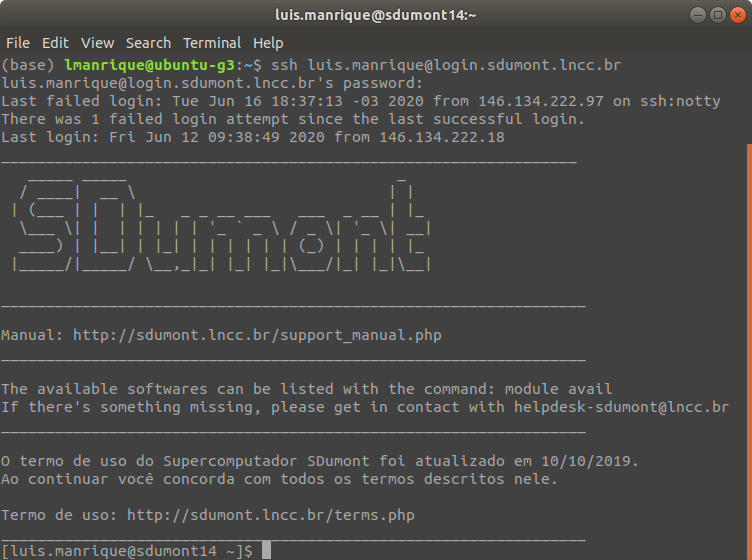

<h1 align="center"> Webinar - Cluster Santos Dumont </h1>
<h2 align="center"> Acesso e submissão de jobs </h2>
   
|  | 
|:--:| 
| Fonte da imagem: https://itforum365.com.br/lncc-e-coppe-abrem-chamada-para-uso-de-supercomputadores/ |

## Sumário

1. [Introdução ao cluster Santos Dumont](#introducao)

   - [Hardware](#hardware)
   - [Filas](#filas)

1. [Projeto CADASE](#cadase)

   - [Tempo de computação](#tempo)
   - [Prazo para o uso](#prazo)
   - [Cotas](#cotas)

1. [Requisitos de acesso](#requisitos)

   - [Ativação da conta](#ativacao)
   - [Acesso VPN](#acesso_vpn)

   1. [Recomendações de ferramentas](#recomendacoes)
      - [Screen](#screen)
      - [Vim](#editor)

1. [Acessando o Santos Dumont](#acesso)

1. [Entendendo as partições dos discos](#particoes)

   - [/home](#home)
   - [/prj](#prj)
   - [/scratch](#scracth)

1. [Transferência de dados](#transferencia)

   - [Enviando arquivos](#envio)
   - [Recebendo arquivos](#recebimento)

1. [Module](#module)

   - [module avail](#)
   - [module load](#)
   - [module unload](#)
   - [module purge](#)

1. [Compilando código C/C++](#compilacao1)

   - [Carregando os módulos necessários](#)
   - [Encontrando módulos necessários a partir de erros na compilação](#)

1. [Compilando código C/C++ com openMP e openMPI](#compilacao2)

   - [Carregando os módulos necessários](#)

1. [SLURM](#slurm)

   - [Comandos básicos](#)
     - [sinfo](#)
     - [squeue](#)
     - [scancel](#)
   - [Alocando recursos](#)
     - [srun](#)
     - [sbatch](#)
   - [Filas do SLURM](#)

1. [srun - Shell em modo interativo e jupyter notebook](#srun)

   - [Rodando um script em python](#)
   - [Acessado o jupyter notebook remotamente](#jupyter)

1. [sbatch - Submissão de jobs](#sbatch)
   - [Rodando um código C com openMP](#)
   - [Rodando um código C com MPI](#)

## Introdução 

**Breve Histórico**

O supercomputador Santos Dumont (SDumont), adquirido junto a empresa francesa ATOS/BULL, está localizado na sede do Laboratório Nacional de Computação Científica (LNCC), em Petrópolis-RJ, atuando como nó central (Tier-0) do Sistema Nacional de Processamento de Alto Desempenho - SINAPAD. 

A primeira versão do SDumont (2015), chamada de "SDumont Base", possuía um total de 18.424 núcleos de CPU, distribuídos em 758 nós computacionais utilizando a tecnologia BullX B700.   No quarto trimestre de 2019 o SDumont recebeu uma expansão computacional, composta da tecnologia BullSequana X, que aumentou o poder computacional de 1,1 Petaflops para 5,1 Petaflops. Após essa expansão o SDumont passou a contar com um total de 34.688 núcleos de CPU, distribuídos em 1132 nós computacionais.

## Hardware 

<table class="tg">
<thead>
  <tr>
    <th class="tg-7btt">Qtd. de nós</th>
    <th class="tg-7btt">Processador</th>
    <th class="tg-7btt">Número de cores por nó</th>
    <th class="tg-7btt">Memória</th>
    <th class="tg-7btt">Acelerador</th>
  </tr>
</thead>
<tbody>
  <tr>
    <td class="tg-c3ow">504</td>
    <td class="tg-c3ow">2 x Intel Xeon E5-2695v2</td>
    <td class="tg-c3ow">24</td>
    <td class="tg-c3ow">64GB</td>
    <td class="tg-c3ow"></td>
  </tr>
  <tr>
    <td class="tg-c3ow">198</td>
    <td class="tg-c3ow">2 x Intel Xeon E5-2695v2</td>
    <td class="tg-c3ow">24</td>
    <td class="tg-c3ow">64GB</td>
    <td class="tg-c3ow">1 x NVIDIA K40</td>
  </tr>
  <tr>
    <td class="tg-c3ow">54</td>
    <td class="tg-c3ow">2 x Intel Xeon E5-2695v2</td>
    <td class="tg-c3ow">24</td>
    <td class="tg-c3ow">64GB</td>
    <td class="tg-7btt">1 x Xeon Phi 7120</td>
  </tr>
  <tr>
    <td class="tg-c3ow">1</td>
    <td class="tg-c3ow">16 x Intel Xeon Ivy Bridge</td>
    <td class="tg-c3ow">240</td>
    <td class="tg-c3ow">6TB</td>
    <td class="tg-c3ow"></td>
  </tr>
  <tr>
    <td class="tg-c3ow">246</td>
    <td class="tg-c3ow">2 x Intel Xeon Skylake 6152</td>
    <td class="tg-c3ow">48</td>
    <td class="tg-c3ow">384GB</td>
    <td class="tg-c3ow"></td>
  </tr>
  <tr>
    <td class="tg-c3ow">36</td>
    <td class="tg-c3ow">2 x Intel Xeon Skylake 6152</td>
    <td class="tg-c3ow">48</td>
    <td class="tg-c3ow">768GB</td>
    <td class="tg-c3ow"></td>
  </tr>
  <tr>
    <td class="tg-c3ow">94</td>
    <td class="tg-c3ow">2 x Intel Xeon Skylake 6152</td>
    <td class="tg-c3ow">48</td>
    <td class="tg-c3ow">384GB</td>
    <td class="tg-c3ow">4 x NVIDIA V100</td>
  </tr>
  <tr>
    <td class="tg-c3ow">1</td>
    <td class="tg-c3ow">2 x Intel Xeon Skylake 6148</td>
    <td class="tg-c3ow">40</td>
    <td class="tg-c3ow">384GB</td>
    <td class="tg-c3ow">8 x NVIDIA V100</td>
  </tr>
</tbody>
</table>

## Projeto CADASE 

## Requisitos de acesso 

## Acessando o Santos Dumont 

<ol>

 <li>Se conecte à rede VPN utilizando o manual do Santos Dumont enviado por e-mail pelo helpdesk.</li> 

 <li>Estabeleça a conexão via ssh com: <b><i>ssh user@login.sdumont.lncc.br</i></b></li> 

</ol>

## Entendendo as partições dos discos 

## Transferência de dados 

## Module 

## Compilando código C/C++ 

## Compilando código C/C++ com openMP e openMPI 

## SLURM 

## srun - Shell em modo interativo e jupyter notebook 

### Rodando um script em python

### Acessado o jupyter notebook remotamente 

<ol>

 <li>Utilize o comando <b><i>srun</i></b> para alocar o node que será utilizado em modo interativo.   O parâmetro <b><i>-p</i></b> serve para identifcar a fila utilizada, o <b><i>--pty bash -i</i></b> identifca o tipo de shell da sessão que será retornada.   Outros parâmetros não utilizados aqui podem servir para requisitar uma quantidade específica memória, uso exclusivo do node, número de tasks (processos mpi), etc. Confira outros parâmetros e os tipos de máquinas de cada fila no manual do usuário.  Aproveite para guardar o hostname do node que foi alocado.</li> 

 <li>Carregue o anaconda com <b><i>eval "\$(/scratch/cadase/app/anaconda3/bin/conda shell.bash hook)"</i></b>. Neste exemplo iremos utilizar o Devito como exemplo, para tanto carregaremos o ambiente com: <b><i>conda activate devito</i></b></li> 

 <li>Inicialize o notebook com: <b><i>jupyter-lab --no-browser --ip=0.0.0.0</i></b></li> 

 <li>Abra um novo terminal e crie um túnel para acessar o notebook, utilize o hostname do node alocado anteriormente:<b><i> ssh -L 8888:hostname:8888 user@login.sdumont.lncc.br</i></b></li> 

 <li>Utilize o terminal com a sessão do jupyter notebook aberta para copiar a url e cole no browser como no exemplo abaixo:</li> 

</ol>

## sbatch - Submissão de jobs 
